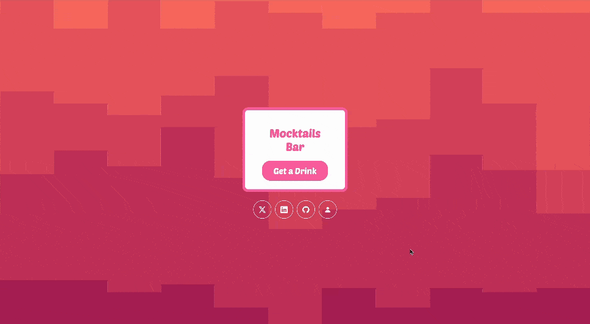

# 🍹 Mocktails Bar : [Visit Here](https://mocktails-bar.netlify.app/)

A simple app that generate a random mocktail from the [TheCocktailDB API](https://www.thecocktaildb.com/).

## How It's Made:

**Tech used:** HTML, CSS, JavaScript, [TheCocktailDB API](https://www.thecocktaildb.com/).

## Optimizations
Updated to use async/await for handling asynchronous tasks, improving code readability and simplifying maintenance.

## Lessons Learned:
While building the Mocktails Bar app, I gained practical experience integrating third-party APIs, specifically TheCocktailDB API, and handled various data fetch scenarios. By using async/await for asynchronous programming, I simplified the code and made it more readable and maintainable. Additionally, creating a responsive design improved my CSS skills, ensuring the app looks good on all devices

